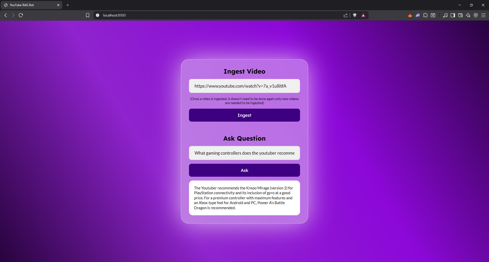

# YouTube RAG Bot

A Django-based Retrieval-Augmented Generation (RAG) application that allows you to ask questions about YouTube video transcripts. The app extracts transcripts, embeds them using Google Gemini, stores vectors in Weaviate, and uses AI to answer your questions about the video content.

## Features

- **Video Ingestion**: Extract and process transcripts from YouTube videos
- **Smart Chunking**: Overlapping text chunks for better context preservation
- **Vector Embeddings**: Uses Google Gemini's embedding model for semantic search
- **RAG Pipeline**: Retrieves relevant transcript chunks and generates contextual answers
- **REST API**: Simple endpoints for ingestion and querying
- **Web Interface**: Clean HTML frontend for user interaction

## Tech Stack

- **Backend**: Django 6.0
- **Vector Database**: Weaviate
- **AI/ML Models**: Google Gemini (embeddings & generation)
- **APIs**: YouTube Transcript API
- **Frontend**: HTML/CSS
- **Web Server**: Django development server (WhiteNoise for static files)

## Prerequisites

Before you begin, ensure you have:

- **Python 3.12+** installed
- **pip** package manager
- **API Keys**:
    - Google Gemini API key
    - Weaviate Cloud instance

## Installation

### 1. Clone or Download the Project

```bash
cd yt_rag_bot
```

### 2. Create a Virtual Environment (Recommended)

```bash
# On Windows
python -m venv venv
venv\Scripts\activate

# On macOS/Linux
python3 -m venv venv
source venv/bin/activate
```

### 3. Install Dependencies

```bash
pip install -r requirements.txt
```

### 4. Set Up Environment Variables

Create a `.env` file in the project root directory with the following variables:

```
GEMINI_API_KEY=your_gemini_api_key_here
WEAVIATE_URL=your_weaviate_cluster_url
WEAVIATE_API_KEY=your_weaviate_api_key
```

Replace the values with your actual API credentials

## Running the Application

### Start the Development Server

```bash
python manage.py runserver
```

The application will be available at `http://localhost:8000`

## API Usage

### 1. Ingest a YouTube Video

**Endpoint**: `POST /ingest-video`

**Request Body**:

```json
{
    "url": "https://www.youtube.com/watch?v=VIDEO_ID"
}
```

**Response**:

```json
{
    "status": "ingested"
}
```

### 2. Ask a Question

**Endpoint**: `POST /ask-question`

**Request Body**:

```json
{
    "question": "What is the main topic of the video?"
}
```

**Response**:

```json
{
    "answer": "The video discusses..."
}
```

The App also has a simple frontend that allows users to ingest videos, ask questions, and view answers. available at `/ (root url)`.

## How It Works

1. **Ingestion Phase**:
    - User provides a YouTube video URL
    - Extract transcript using YouTube Transcript API
    - Split transcript into overlapping chunks (800 words, 150-word overlap)
    - Generate embeddings for each chunk using Google Gemini
    - Store chunks and embeddings in Weaviate vector database

2. **Query Phase**:
    - User asks a question
    - Generate embedding for the question
    - Search Weaviate for semantically similar transcript chunks
    - Pass question and relevant chunks to Gemini
    - Return generated answer

## Future Enhancements

- User authentication and session management
- Support for multiple languages
- Batch video processing
- Answer confidence scoring
- Chat history and conversation context
- Production-ready deployment configuration

## Application Screenshots


